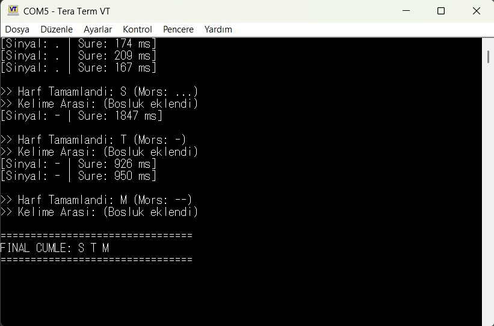

# STM32 Morse Code Decoder

This project implements an interactive Morse code decoder using an STM32 microcontroller. By measuring the duration of button presses, the system interprets dots (.) and dashes (-) in real-time, decodes them into characters, and displays the final message via UART.

## Project Overview
This application converts tactile input (a push-button) into digital text, showcasing advanced polling-based timing and state machine logic.

## Features
- **Real-time Decoding:** Differentiates between 'dot' and 'dash' based on input duration.
- **Timing Logic:** Automatically handles letter intervals, word spaces, and sentence completion using `HAL_GetTick()`.
- **UART Integration:** Provides serial feedback for each signal and final message output.
- **Visual Feedback:** LED signaling during active input capture.

## Technical Architecture

- **Microcontroller:** STM32
- **Input:** Push-button (GPIO Input)
- **Output:** UART (Serial Terminal)
- **Language:** C (HAL Library)

## How It Works
1. **Signal Capture:** The duration of the button press is measured to classify signals as dots (<500ms) or dashes (>=500ms).
2. **Buffer Management:** Decoded signals are stored in `mors_haznesi` and translated into characters.
3. **Timed Logic:**
   - **>3s:** Completes a letter.
   - **>1s:** Adds a word space.
   - **>7s:** Finalizes the sentence and prints the result to the UART terminal.

## License
Copyright (c) 2026 STMicroelectronics. Provided as-is.
--------------------------------------------------------------------------------------------------------------------------------------------------------------------------
# STM32 Mors Alfabesi Çözücü

Bu proje, bir STM32 mikrokontrolcüsü kullanarak interaktif bir Mors alfabesi çözücü uygulamasıdır. Fiziksel bir buton ile girilen sinyalleri (nokta ve çizgi) gerçek zamanlı olarak işler, karakterlere dönüştürür ve UART üzerinden nihai mesajı terminale yazdırır.

## Proje Genel Bakış
Bu uygulama, fiziksel bir buton girişini dijital metne dönüştürerek, zamanlama tabanlı döngüleri ve durum makinesi (state machine) mantığını göstermektedir.

## Özellikler
- **Gerçek Zamanlı Çözümleme:** Butona basılma süresine göre nokta (.) ve çizgi (-) ayrımı.
- **Zamanlama Mantığı:** `HAL_GetTick()` kullanarak harf aralıklarını, kelime boşluklarını ve cümle sonlarını otomatik algılama.
- **UART Entegrasyonu:** Her sinyal için seri terminal üzerinden anlık geri bildirim ve final mesaj çıktısı.
- **Görsel Geri Bildirim:** Giriş esnasında LED üzerinden sinyal bildirimi.

## Teknik Mimari

- **Mikrokontrolcü:** STM32
- **Giriş:** Push-button (GPIO Input)
- **Çıkış:** UART (Seri Terminal)
- **Programlama Dili:** C (HAL Kütüphanesi)

## Çalışma Mantığı
1. **Sinyal Yakalama:** Butona basılı tutma süresi ölçülerek sinyal nokta (<500ms) veya çizgi (>=500ms) olarak sınıflandırılır.
2. **Tampon Yönetimi:** Çözülen sinyaller `mors_haznesi` dizisinde biriktirilir ve karakter karşılığı bulunur.
3. **Zamanlama Algoritması:**
   - **>3 saniye:** Harfi tamamlar ve diziye ekler.
   - **>1 saniye:** Kelime arasına boşluk ekler.
   - **>7 saniye:** Cümleyi bitirir ve terminale yazdırır.

## Lisans
Telif Hakkı (c) 2026 STMicroelectronics. "Olduğu gibi" sağlanmıştır.
